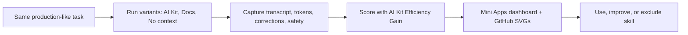
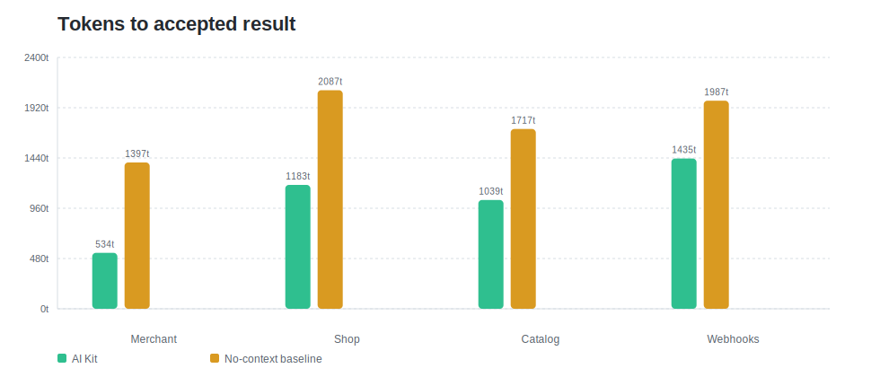
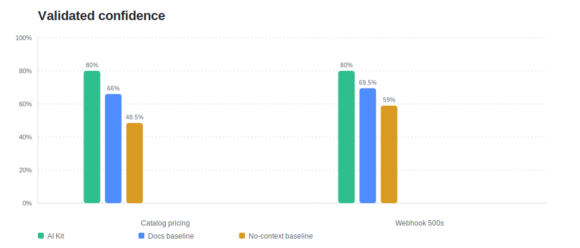
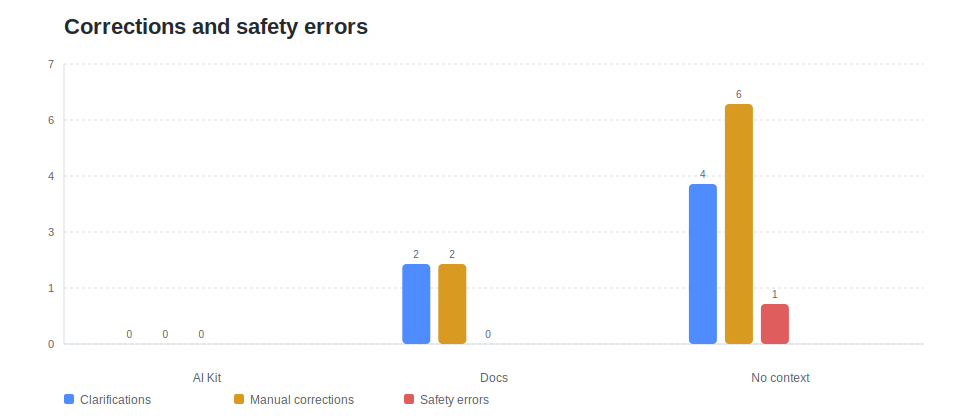

# AI Kit Evals Package

Reusable evaluation package for AI Kit skills.

This folder is designed to be copied into `xsolla-ai-kit` or sent as a standalone GitHub package.

## What It Contains

- OpenAI Evals-style registry:
  - `evals/registry/evals/ai_kit_skills.yaml`
  - `evals/registry/data/ai_kit_skills/samples.jsonl`
  - `evals/registry/data/ai_kit_skills/judge.json`
- Custom eval skeleton:
  - `evals/ai_kit_evals/eval.py`
- Reusable runner:
  - `scripts/run_ai_kit_eval.py`
- GitHub-renderable visualizations:
  - `visualizations/*.svg`
- Mini Apps dashboard:
  - `mini-app/`

## Methodology

We compare the same task across variants:

- `AI Kit`
- `Docs baseline`
- `No-context baseline`

Metrics:

- Tokens to accepted result.
- Clarification turns.
- Manual corrections.
- Skill-rubric coverage.
- Validated confidence.
- Safety errors.

Main formula:

```text
AI Kit Efficiency Gain =
  0.30 * Token Reduction %
+ 0.25 * Clarification Reduction %
+ 0.20 * Manual Correction Reduction %
+ 0.15 * Validated Confidence Delta
+ 0.10 * Safety Error Reduction %
```

Validated confidence:

```text
validated_confidence =
  skill_checklist_pass_rate * 0.70
+ sme_review_score * 0.20
+ sandbox_execution_score * 0.10
```

## Eval Flow



## Run Standalone Eval

```bash
python3 scripts/run_ai_kit_eval.py path/to/eval-runs.json --out-dir eval-output
```

Outputs:

```text
eval-output/ai-kit-eval-report.md
eval-output/ai-kit-eval-score.json
eval-output/dashboard-data.json
```

## OpenAI Evals-Style Usage

The registry follows the OpenAI Evals custom-eval convention:

```yaml
ai_kit_skills.v0:
  class: ai_kit_evals.eval:AiKitSkillEval
  args:
    samples_jsonl: ai_kit_skills/samples.jsonl
    judge_json: ai_kit_skills/judge.json
```

Install locally when wiring into an OpenAI Evals environment:

```bash
pip install -e .[openai-evals]
```

Then point your eval runner at:

```text
evals/registry/evals/ai_kit_skills.yaml
```

OpenAI Evals reference: [openai/evals](https://github.com/openai/evals.git)

## Mini Apps Dashboard

The Mini Apps dashboard is in:

```text
mini-app/
```

Run locally:

```bash
cd mini-app
pnpm install
pnpm dev
```

Validation note: the local workspace used to create this package did not have `pnpm` installed, so the Mini App was not built locally. JSON/JSONL files and Python scripts were validated, and the app structure follows the `xsolla/mini-apps` Vite/React mini-site pattern.

Update dashboard data:

```bash
python3 ../scripts/run_ai_kit_eval.py ../path/to/eval-runs.json --out-dir ../eval-output
cp ../eval-output/dashboard-data.json src/data/dashboard-data.json
```

Mini Apps reference shape used from `xsolla/mini-apps`:

- `mini-app.json`
- `package.json`
- `src/main.tsx`
- `src/App.tsx`
- `vite.config.ts`

## GitHub Visualizations

### Tokens To Accepted Result



### Validated Confidence



### Corrections And Safety



## Decision Rule

Use AI Kit for a skill when:

- Efficiency gain is `>=25%`.
- Safety errors are `0`.
- Validated confidence improves vs docs baseline.
- Manual corrections and clarifications are lower than baseline.

Exclude a skill when:

- Skill content is placeholder.
- Safety error appears.
- Validated confidence is not better than docs baseline.
- Sandbox execution or SME review is missing for launch-critical use.

